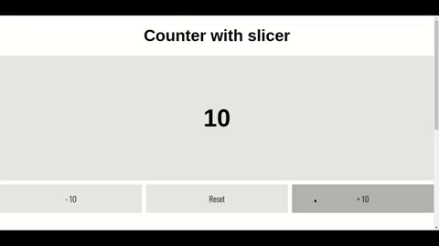

This project was bootstrapped with [Create React App](https://github.com/facebookincubator/create-react-app).

Below you will fpurpose and motivation for the project.<br>


## Table of Contents

- [Motivation](#updating-to-new-releases)
- [Available Scripts](#available-scripts)
  - [npm start](#npm-start)
  - [npm run build](#npm-run-build)
  - [npm run eject](#npm-run-eject)


## Motivation

Reduce the code for a redux application as much as possible.

* `Interviewer` I want to use redux but do not want to write action, reducer and selectors everytime or atleast want to avoid it as much as possible.
* `me` ???????

##### So here we go

We would take example of a simple counter which would have 3 operations. <br>


<!--  -->

Each of the actions would be handled by **redux**

1.   ##### Traditional Way

	  *Write an action, reducer and selector as shown below*

###### action.js

```javascript
export const INCREMENT = 'counter/increment';
export const DECREMENT = 'counter/decrement';
export const CLEAR = 'counter/clear';

export const increment = () => {
  return {
    type: INCREMENT
  };
};

export const decrement = () => {
  return {
    type: DECREMENT
  };
};

export const clear = () => {
  return {
    type: CLEAR
  };
};

```
###### reducer.js

```javascript
const INITIAL_STATE = 10;
import { INCREMENT, DECREMENT, CLEAR } from './action';

export const counter = (state = INITIAL_STATE, action) => {
  switch (action.type) {
    case INCREMENT:
      return state + 10;
    case DECREMENT:
      return state -10;
    case CLEAR:
      return 10;
    default:
      return state;
  }
};
```
###### selector.js

```javascript
export const getCounter = (state) => {
    return state.counter;
}
```
2. ##### Modern Way

Now with the help of **createSlice** method we are good to go with just the following code

```javascript
export const counter = createSlice({
  slice: 'counter',
  initialState: 10,
  reducers: {
    increment: state => state + 10,
    decrement: state => state - 10,
    clear: () => 10
  }
});

// That is all :) 
const {actions, reducer, selectors} = counter;

```

## Available Scripts

In the project directory, you can run:

### `npm start`

Runs the app in the development mode.<br>
Open [http://localhost:3000](http://localhost:3000) to view it in the browser.

The page will reload if you make edits.<br>
You will also see any lint errors in the console.

### `npm run build`

Builds the app for production to the `build` folder.<br>
It correctly bundles React in production mode and optimizes the build for the best performance.

The build is minified and the filenames include the hashes.<br>
Your app is ready to be deployed!

See the section about [deployment](#deployment) for more information.

### `npm run eject`

**Note: this is a one-way operation. Once you `eject`, you can’t go back!**

If you aren’t satisfied with the build tool and configuration choices, you can `eject` at any time. This command will remove the single build dependency from your project.

Instead, it will copy all the configuration files and the transitive dependencies (Webpack, Babel, ESLint, etc) right into your project so you have full control over them. All of the commands except `eject` will still work, but they will point to the copied scripts so you can tweak them. At this point you’re on your own.

You don’t have to ever use `eject`. The curated feature set is suitable for small and middle deployments, and you shouldn’t feel obligated to use this feature. However we understand that this tool wouldn’t be useful if you couldn’t customize it when you are ready for it.

